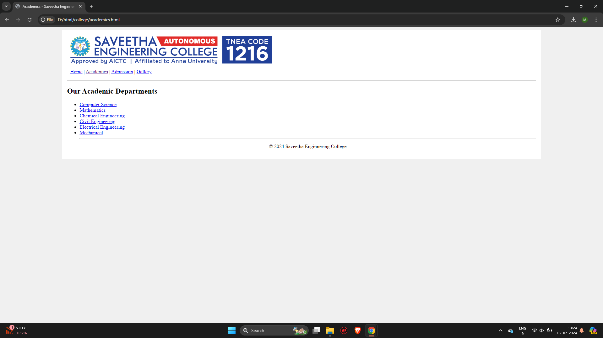
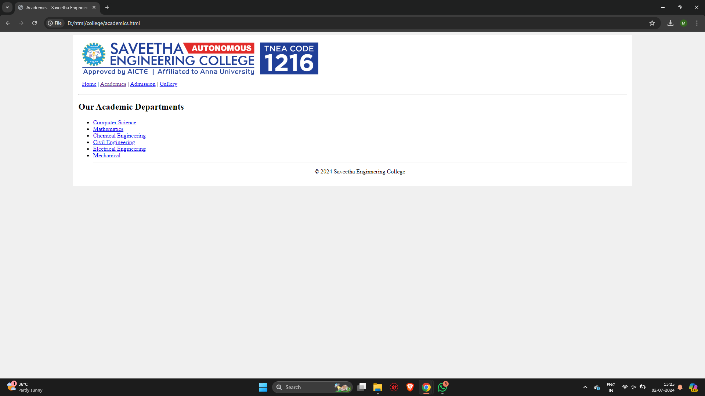
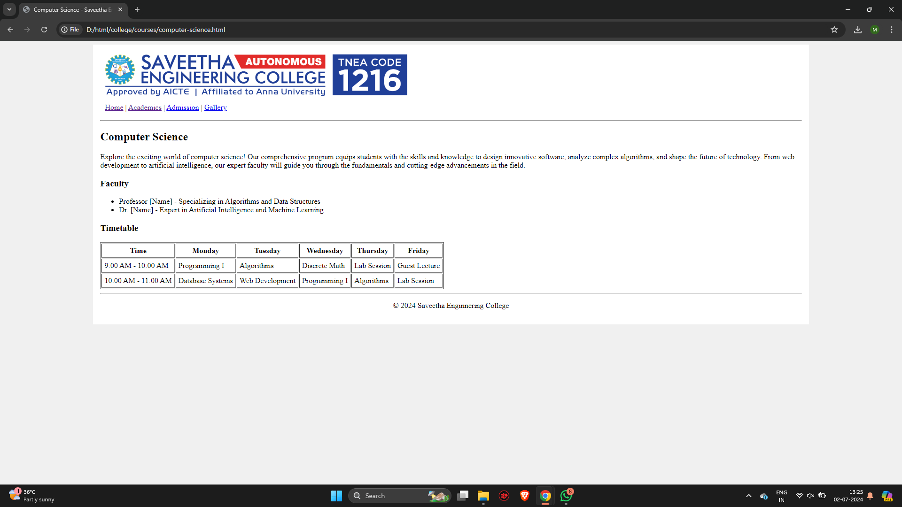
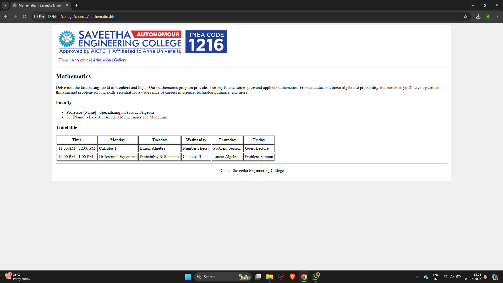
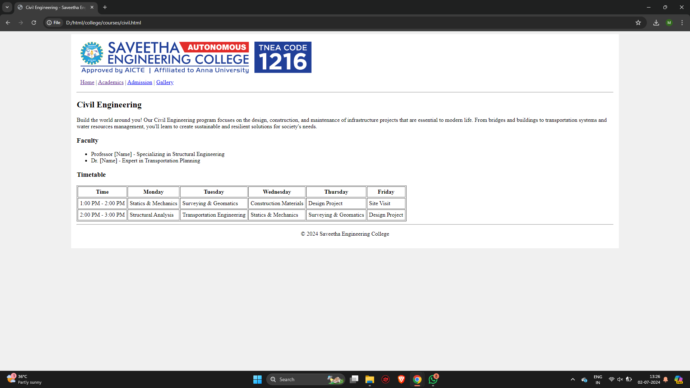
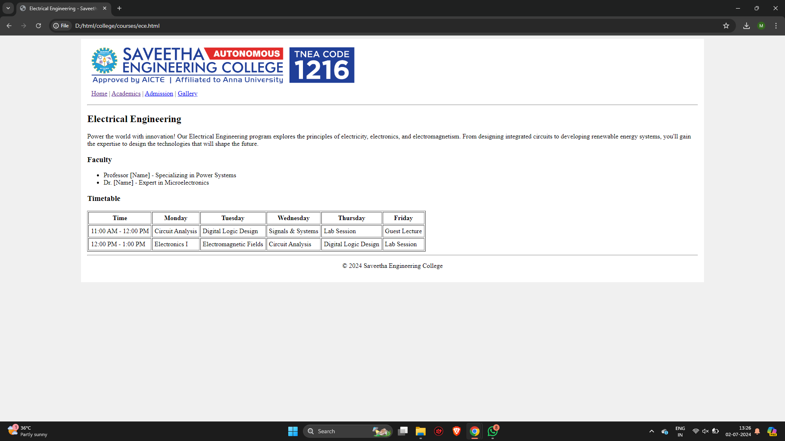
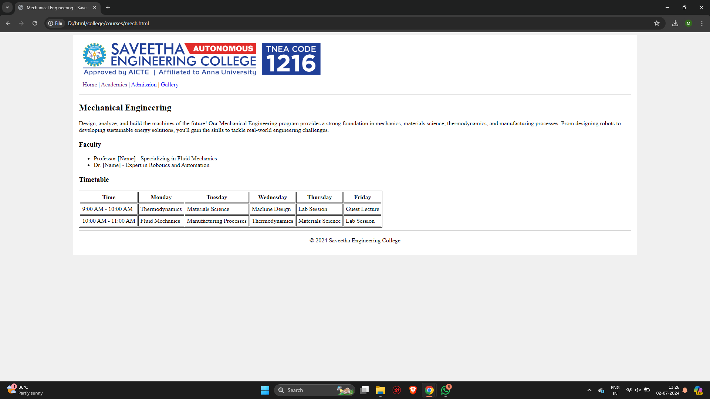
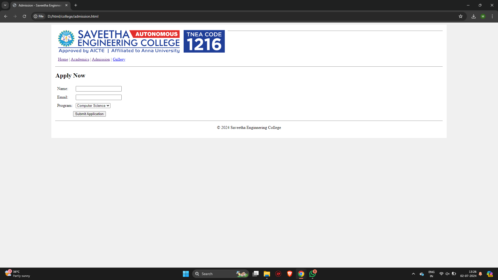
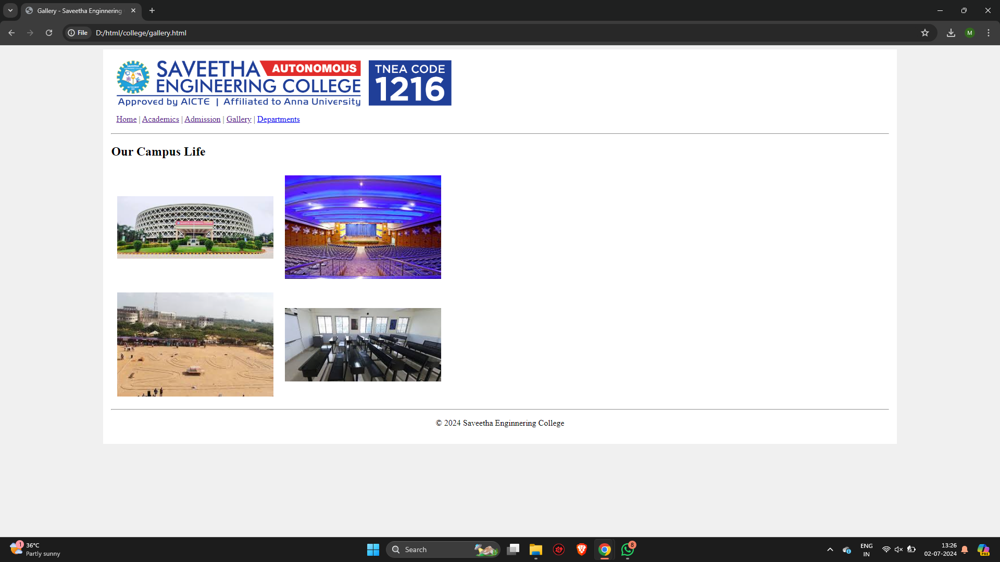

## 1.html
```
<!DOCTYPE html>
<html>
    <head>
        <style>
            table,th,td{border:1px solid black}
        </style>

    </head>
<body>
    <table cellpadding ="5">
        <tr>
            <th align="center" colspan="4"><span style="background-color: yellow;">Day</span></th>

        </tr>
        <tr>
            <td>
                <ol type="1">
                    <li>wake up early</li>
                    <ul>
                        <li type="square">5AM</li>
                        <li>walk</li>
                        <li>jog</li>
                    </ul>
                </ol>
                
            </td>
            <td rowspan="3">

                <table width="100%">
                    <th align="center" colspan="2"><span style="background-color: yellow;">Things to watch</span></th>
                    <tr >
                        <td></td>
                        <td></td>

                    </tr>
                    <tr>
                        <td></td>
                        <td></td>

                    </tr>

                </table>
            </td>


        </tr>
        <tr>
            <td><ol type="1" start="2">
                <li>breakfast</li> 
                <ul>
                    <li type="square">8AM</li>
                    <li>eggs</li>
                    <li>coffee</li>
                </ul>
            </ol></td>

        </tr>
        <tr>
            <td><ol type="1" start="3">
                <li>go to saveetha</li> 
                <ul>
                    <li type="square">8AM</li>
                    <li>attend class</li>
                    <li>to be continued</li>
                </ul>
            </ol></td>

        </tr>
    </table>
</body>
</html>
```


```
2. Design a website for a College. There should be at least 15 web-pages present in the web-site. There should be:

college-website/
├── index.html
├── academics.html
├── admission.html
├── gallery.html
├── courses/
│   ├── computer-science.html
│   ├── mathematics.html
│   ├── english.html
│   ├── sociology.html
│   ├── economics.html
│   ├── business-management.html

└── images/
    ├── logo.png
    ├── gallery1.jpg
    ├── gallery2.jpg
    ├── gallery3.jpg
    └── gallery4.jpg

One Home page that leads to other pages. The Home page should contain the name of the college as heading along with the college logo. There should be a tab with the following links:
Home;
Academics;
Admission;
Gallery. 
 
There should be an appropriate description of the college on the home page.
 One Academics page which contains a list of all the departments present in the college Arts, Science and Commerce. The list should be a nested list, with available courses mentioned under each department. There should be a minimum of two courses under each department, (for e.g. Computer Science and Mathematics under Science, English and Sociology under Arts  and so on). Each Course entry in the list should be a HTML link that leads to a web-page totally dedicated to the course itself.
Each Course should have its own dedicated web-page. This page should contain a description about the course, a list of all the teachers taking the course and the timetable for that particular subject.
The Admission page basically contains a form that a student needs to fill up in order to take admission in the college. The form should ask all the necessary questions using appropriate form elements.
One gallery page that contains set of photos taken of the college and its students.
Please note that each web-page in this website should have the same background Image/color. The looks of each page should be similar.
```
### home.html
```
<!DOCTYPE html>
<html>
<head>
  <title>Saveetha Engineering College</title>
</head>
<body bgcolor="#F0F0F0" text="#000000"> 

  <table width="80%" align="center" cellpadding="15" cellspacing="0"  bgcolor="#FFFFFF">
    <tr>
      <td>
         
        <hr>

        <table width="100%" cellpadding="10" cellspacing="0">
          <tr>
            <td><a href="home.html">Home</a> |
              <a href="academics.html">Academics</a> |
              <a href="admission.html">Admission</a> |
              <a href="gallery.html">Gallery</a>
            </td>
          </tr>
        </table>

        <hr> 

        <h2>Welcome to Saveetha Engineering College</h2>

        <p> Welcome to SEC - Saveetha Engineering College (Autonomous), a distinguished institution established in 2001 under the visionary leadership of Dr. N. M. Veeraiyan— a committed medical professional and philanthropist par excellence. With over 35 years of unwavering commitment to excellence in education, our college has emerged as the forefront of engineering education and research.</p>

        <h3>About Us</h3>
        <p> Saveetha Engineering College is managed by Saveetha Medical and Educational Trust.</p>

        <h3>Academic Excellence</h3>
        <p> At Saveetha Engineering College, we understand the importance of adapting the learner-centric education relevant to 21st-century skillset. This is why we are among the first in India to implement the 'Saveetha Flexi Learn' where Learners can select Subject, Faculty, Schedule & Domain Electives. </p>

        <h3>Student Life</h3>
        <p> Campus Life at SEC - Saveetha Engineering College (Autonomous) is lively, and enriching, fostering a perfect blend of academics & extracurricular activities. Learners enjoy a community-oriented environment, diverse dining options, and relaxing lush beautiful green spaces. With a strong emphasis on sports, fitness, and cutting-edge technology, SEC ensures a dynamic experience for everyone.</p>

        <h3>Career Focus</h3>
        <p> To be and to be recognized for setting the standard of excellence in engineering education and high quality research in Science and Technology. </p>

        <hr>

        <p align="center">© 2024 Saveetha Engineering College</p>
      </td>
    </tr>
  </table>

</body>
</html>
```
### gallery.html
```
<!DOCTYPE html>
<html>
<head>
  <title>Gallery - Saveetha Enginnering College</title>
</head>
<body bgcolor="#F0F0F0" text="#000000"> 

  <table width="80%" align="center" cellpadding="15" cellspacing="0" bgcolor="#FFFFFF">
    <tr>
      <td>
         

        <table width="100%" cellpadding="10" cellspacing="0">
          <tr>
            <td><a href="home.html">Home</a> |
              <a href="academics.html">Academics</a> |
              <a href="admission.html">Admission</a> |
              <a href="gallery.html">Gallery</a> |
              <a href="department.html">Departments</a>
            </td>
          </tr>
        </table>

        <hr> 

        <h2>Our Campus Life</h2>

        <table cellpadding="10">
          <tr>
            <td></td>
            <td></td>
          </tr>
          <tr>
            <td></td>
            <td></td>
          </tr>
        </table>

        <hr>

        <p align="center">© 2024 Saveetha Enginnering College</p>
      </td>
    </tr>
  </table>

</body>
</html>
```
### admission.html
```
<!DOCTYPE html>
<html>
<head>
  <title>Admission - Saveetha Enginnering College</title>
</head>
<body bgcolor="#F0F0F0" text="#000000"> 

  <table width="80%" align="center" cellpadding="15" cellspacing="0" bgcolor="#FFFFFF">
    <tr>
      <td>
        
        <hr>

        <table width="100%" cellpadding="10" cellspacing="0">
          <tr>
            <td><a href="home.html">Home</a> |
              <a href="academics.html">Academics</a> |
              <a href="admission.html">Admission</a> |
              <a href="gallery.html">Gallery</a>
            </td>
          </tr>
        </table>

        <hr> 

        <h2>Apply Now</h2>

        <form action="#" method="post"> 
          <table cellpadding="5"> 
            <tr>
              <td><label for="name">Name:</label></td>
              <td><input type="text" id="name" name="name" required></td>
            </tr>
            <tr>
              <td><label for="email">Email:</label></td>
              <td><input type="email" id="email" name="email" required></td>
            </tr>
            <tr>
              <td><label for="program">Program:</label></td>
              <td>
                <select id="program" name="program">
                  <option value="computer-science">Computer Science</option>
                  <option value="mathematics">Mathematics</option>
                  </select>
              </td>
            </tr>
            <tr>
              <td colspan="2" align="center"><button type="submit">Submit Application</button></td>
            </tr>
          </table>
        </form>

        <hr>

        <p align="center">© 2024 Saveetha Enginnering College</p>
      </td>
    </tr>
  </table>

</body>
</html>
```
### academics.html
```
<!DOCTYPE html>
<html>
<head>
  <title>Academics - Saveetha Enginnering College</title>
</head>
<body bgcolor="#F0F0F0" text="#000000"> 

  <table width="80%" align="center" cellpadding="15" cellspacing="0"  bgcolor="#FFFFFF">
    <tr>
      <td>
         

        <table width="100%" cellpadding="10" cellspacing="0">
          <tr>
            <td><a href="index.html">Home</a> |
              <a href="academics.html">Academics</a> |
              <a href="admission.html">Admission</a> |
              <a href="gallery.html">Gallery</a>
            </td>
          </tr>
        </table>

        <hr> 

        <h2>Our Academic Departments</h2>
        <ul>
          <li><a href="courses/computer-science.html">Computer Science</a></li>
          <li><a href="courses/mathematics.html">Mathematics</a></li>
          <li><a href="courses/chemical.html">Chemical Engineering</a></li>
          <li><a href="courses/civil.html">Civil Engineering</a></li>
          <li><a href="courses/ece.html">Electrical Engineering</a></li>
          <li><a href="courses/mech.html">Mechanical</a></li>

        <hr>

        <p align="center">© 2024 Saveetha Enginnering College</p>
      </td>
    </tr>
  </table>

</body>
</html>
```
## Courses/
### BioMedical.html
```
<!DOCTYPE html>
<html>
<head>
  <title>Biomedical Engineering - Saveetha Engineering College</title>
</head>
<body bgcolor="#F0F0F0" text="#000000"> 

  <table width="80%" align="center" cellpadding="15" cellspacing="0"  bgcolor="#FFFFFF">
    <tr>
      <td>
         

        <table width="100%" cellpadding="10" cellspacing="0">
          <tr>
            <td><a href="../home.html">Home</a> |
              <a href="../academics.html">Academics</a> |
              <a href="../admission.html">Admission</a> |
              <a href="../gallery.html">Gallery</a>
            </td>
          </tr>
        </table>
        <hr> 

        <h2>Biomedical Engineering</h2>

        <p>Be at the forefront of healthcare innovation! Biomedical 
          Engineering combines principles of engineering with biology 
          and medicine to develop new technologies and devices for 
          diagnosing, treating, and monitoring diseases. You'll work 
          on projects ranging from prosthetics and medical imaging 
          to tissue engineering and drug delivery systems.</p>

        <h3>Faculty</h3>
        <ul> 
          <li>Professor [Name] - Specializing in Biomaterials</li>
          <li>Dr. [Name] - Expert in Medical Imaging</li>
        </ul>

        <h3>Timetable</h3>
        <table border="1" cellpadding="5">
          <tr> 
            <th>Time</th>
            <th>Monday</th>
            <th>Tuesday</th> 
            <th>Wednesday</th>
            <th>Thursday</th>
            <th>Friday</th>
          </tr>
          <tr>
            <td>9:00 AM - 10:00 AM</td>
            <td>Biomechanics</td>
            <td>Physiology for Engineers</td>
            <td>Biomaterials </td> 
            <td>Design Project </td>
            <td>Guest Lecture</td>
          </tr> 
          <tr>
            <td>10:00 AM - 11:00 AM</td>
            <td>Biomedical Instrumentation</td>
            <td>Cellular Engineering</td>
            <td>Biomechanics</td>
            <td>Physiology for Engineers </td>
            <td>Design Project</td>
          </tr>
        </table> 

        <hr>
        <p align="center">© 2024 Saveetha Engineering College</p>
      </td>
    </tr>
  </table>
</body>
</html>
```
## chemical.html
```
<!DOCTYPE html>
<html>
<head>
  <title>Chemical Engineering - Saveetha Engineering College</title>
</head>
<body bgcolor="#F0F0F0" text="#000000"> 

  <table width="80%" align="center" cellpadding="15" cellspacing="0"  bgcolor="#FFFFFF">
    <tr>
      <td>
         

        <table width="100%" cellpadding="10" cellspacing="0">
          <tr>
            <td><a href="../home.html">Home</a> |
              <a href="../academics.html">Academics</a> |
              <a href="../admission.html">Admission</a> |
              <a href="../gallery.html">Gallery</a>
            </td>
          </tr>
        </table>
        <hr> 

        <h2>Chemical Engineering</h2>

        <p>Transform raw materials into valuable products! Chemical 
           Engineering combines chemistry, physics, and mathematics to 
           design and optimize processes in a variety of industries, 
           including pharmaceuticals, energy, food processing, and 
           environmental protection. </p>

        <h3>Faculty</h3>
        <ul> 
          <li>Professor [Name] - Specializing in Process Control</li>
          <li>Dr. [Name] - Expert in Catalysis and Reactor Design</li>
        </ul>

        <h3>Timetable</h3>
        <table border="1" cellpadding="5">
          <tr> 
            <th>Time</th>
            <th>Monday</th>
            <th>Tuesday</th> 
            <th>Wednesday</th>
            <th>Thursday</th>
            <th>Friday</th>
          </tr>
          <tr>
            <td>3:00 PM - 4:00 PM</td>
            <td>Chemical Thermodynamics</td>
            <td>Fluid Mechanics</td>
            <td>Process Dynamics and Control </td> 
            <td>Lab Session </td>
            <td>Seminar </td>
          </tr> 
          <tr>
            <td>4:00 PM - 5:00 PM</td>
            <td>Heat & Mass Transfer</td>
            <td>Chemical Reaction Engineering</td>
            <td>Chemical Thermodynamics </td>
            <td>Fluid Mechanics </td>
            <td>Lab Session</td>
          </tr>
        </table> 

        <hr>
        <p align="center">© 2024 Saveetha Engineering College</p>
      </td>
    </tr>
  </table>
</body>
</html>
```
## Civil.html
```
<!DOCTYPE html>
<html>
<head>
  <title>Civil Engineering - Saveetha Engineering College</title>
</head>
<body bgcolor="#F0F0F0" text="#000000"> 

  <table width="80%" align="center" cellpadding="15" cellspacing="0"  bgcolor="#FFFFFF">
    <tr>
      <td>
         

        <table width="100%" cellpadding="10" cellspacing="0">
          <tr>
            <td><a href="../home.html">Home</a> |
              <a href="../academics.html">Academics</a> |
              <a href="../admission.html">Admission</a> |
              <a href="../gallery.html">Gallery</a>
            </td>
          </tr>
        </table>
        <hr> 

        <h2>Civil Engineering</h2>

        <p>Build the world around you! Our Civil Engineering program 
          focuses on the design, construction, and maintenance of 
          infrastructure projects that are essential to modern life. 
          From bridges and buildings to transportation systems and 
          water resources management, you'll learn to create 
          sustainable and resilient solutions for society's needs.</p>

        <h3>Faculty</h3>
        <ul> 
          <li>Professor [Name] - Specializing in Structural Engineering</li>
          <li>Dr. [Name] - Expert in Transportation Planning</li>
        </ul>

        <h3>Timetable</h3>
        <table border="1" cellpadding="5">
          <tr> 
            <th>Time</th>
            <th>Monday</th>
            <th>Tuesday</th> 
            <th>Wednesday</th>
            <th>Thursday</th>
            <th>Friday</th>
          </tr>
          <tr>
            <td>1:00 PM - 2:00 PM</td>
            <td>Statics & Mechanics</td>
            <td>Surveying & Geomatics</td>
            <td>Construction Materials </td> 
            <td>Design Project </td>
            <td>Site Visit</td>
          </tr> 
          <tr>
            <td>2:00 PM - 3:00 PM</td>
            <td>Structural Analysis</td>
            <td>Transportation Engineering</td>
            <td>Statics & Mechanics</td>
            <td>Surveying & Geomatics </td>
            <td>Design Project</td>
          </tr>
        </table> 

        <hr>
        <p align="center">© 2024 Saveetha Engineering College</p>
      </td>
    </tr>
  </table>
</body>
</html>
```
## commputer-science.html
```
<!DOCTYPE html>
<html>
<head>
  <title>Computer Science - Saveetha Enginnering College</title>
</head>
<body bgcolor="#F0F0F0" text="#000000"> 

  <table width="80%" align="center" cellpadding="15" cellspacing="0"  bgcolor="#FFFFFF">
    <tr>
      <td>
         
        

        <table width="100%" cellpadding="10" cellspacing="0">
          <tr>
            <td><a href="../home.html">Home</a> |
              <a href="../academics.html">Academics</a> |
              <a href="../admission.html">Admission</a> |
              <a href="../gallery.html">Gallery</a>
            </td>
          </tr>
        </table>
        <hr> 

        <h2>Computer Science</h2>

        <p>Explore the exciting world of computer science! Our comprehensive 
           program equips students with the skills and knowledge to design 
           innovative software, analyze complex algorithms, and shape the 
           future of technology. From web development to artificial intelligence, 
           our expert faculty will guide you through the fundamentals and 
           cutting-edge advancements in the field.</p>

        <h3>Faculty</h3>
        <ul> 
          <li>Professor [Name] - Specializing in Algorithms and Data Structures</li>
          <li>Dr. [Name] - Expert in Artificial Intelligence and Machine Learning</li>
        </ul>

        <h3>Timetable</h3>
        <table border="1" cellpadding="5">
          <tr> 
            <th>Time</th>
            <th>Monday</th>
            <th>Tuesday</th> 
            <th>Wednesday</th>
            <th>Thursday</th>
            <th>Friday</th>
          </tr>
          <tr>
            <td>9:00 AM - 10:00 AM</td>
            <td>Programming I</td>
            <td>Algorithms</td>
            <td>Discrete Math</td> 
            <td>Lab Session</td>
            <td>Guest Lecture</td>
          </tr> 
          <tr>
            <td>10:00 AM - 11:00 AM</td>
            <td>Database Systems</td>
            <td>Web Development</td>
            <td>Programming I</td>
            <td>Algorithms</td>
            <td>Lab Session</td>
          </tr>
        </table> 

        <hr>
        <p align="center">© 2024 Saveetha Enginnering College</p>
      </td>
    </tr>
  </table>
</body>
</html>
```
## ece.html
```
<!DOCTYPE html>
<html>
<head>
  <title>Electrical Engineering - Saveetha Engineering College</title>
</head>
<body bgcolor="#F0F0F0" text="#000000"> 

  <table width="80%" align="center" cellpadding="15" cellspacing="0"  bgcolor="#FFFFFF">
    <tr>
      <td>
         

        <table width="100%" cellpadding="10" cellspacing="0">
          <tr>
            <td><a href="../home.html">Home</a> |
              <a href="../academics.html">Academics</a> |
              <a href="../admission.html">Admission</a> |
              <a href="../gallery.html">Gallery</a>
            </td>
          </tr>
        </table>
        <hr> 

        <h2>Electrical Engineering</h2>

        <p>Power the world with innovation! Our Electrical Engineering 
          program explores the principles of electricity, electronics, and 
          electromagnetism.  From designing integrated circuits to developing 
          renewable energy systems, you'll gain the expertise to design 
          the technologies that will shape the future.</p>

        <h3>Faculty</h3>
        <ul> 
          <li>Professor [Name] - Specializing in Power Systems</li>
          <li>Dr. [Name] - Expert in Microelectronics</li>
        </ul>

        <h3>Timetable</h3>
        <table border="1" cellpadding="5">
          <tr> 
            <th>Time</th>
            <th>Monday</th>
            <th>Tuesday</th> 
            <th>Wednesday</th>
            <th>Thursday</th>
            <th>Friday</th>
          </tr>
          <tr>
            <td>11:00 AM - 12:00 PM</td>
            <td>Circuit Analysis</td>
            <td>Digital Logic Design</td>
            <td>Signals & Systems </td> 
            <td>Lab Session </td>
            <td>Guest Lecture</td>
          </tr> 
          <tr>
            <td>12:00 PM - 1:00 PM</td>
            <td>Electronics I</td>
            <td>Electromagnetic Fields</td>
            <td>Circuit Analysis</td>
            <td>Digital Logic Design</td>
            <td>Lab Session </td>
          </tr>
        </table> 

        <hr>
        <p align="center">© 2024 Saveetha Engineering College</p>
      </td>
    </tr>
  </table>
</body>
</html>
```
## mathemticals.html
```
<!DOCTYPE html>
<html>
<head>
  <title>Mathematics - Saveetha Enginnering College</title>
</head>
<body bgcolor="#F0F0F0" text="#000000"> 

  <table width="80%" align="center" cellpadding="15" cellspacing="0"  bgcolor="#FFFFFF">
    <tr>
      <td>
         
      

        <table width="100%" cellpadding="10" cellspacing="0">
          <tr>
            <td><a href="../home.html">Home</a> |
              <a href="../academics.html">Academics</a> |
              <a href="../admission.html">Admission</a> |
              <a href="../gallery.html">Gallery</a>
            </td>
          </tr>
        </table>
        <hr> 

        <h2>Mathematics</h2>

        <p>Delve into the fascinating world of numbers and logic! Our 
           mathematics program provides a strong foundation in pure and 
           applied mathematics. From calculus and linear algebra to 
           probability and statistics, you'll develop critical thinking 
           and problem-solving skills essential for a wide range of careers 
           in science, technology, finance, and more.</p>

        <h3>Faculty</h3>
        <ul> 
          <li>Professor [Name] - Specializing in Abstract Algebra</li>
          <li>Dr. [Name] - Expert in Applied Mathematics and Modeling</li>
        </ul>

        <h3>Timetable</h3>
        <table border="1" cellpadding="5">
          <tr> 
            <th>Time</th>
            <th>Monday</th>
            <th>Tuesday</th> 
            <th>Wednesday</th>
            <th>Thursday</th>
            <th>Friday</th>
          </tr>
          <tr>
            <td>11:00 AM - 12:00 PM</td>
            <td>Calculus I</td>
            <td>Linear Algebra</td>
            <td>Number Theory</td> 
            <td>Problem Session</td>
            <td>Guest Lecture</td>
          </tr> 
          <tr>
            <td>12:00 PM - 1:00 PM</td>
            <td>Differential Equations</td>
            <td>Probability & Statistics</td>
            <td>Calculus II </td>
            <td>Linear Algebra</td>
            <td>Problem Session</td>
          </tr>
        </table> 

        <hr>
        <p align="center">© 2024 Saveetha Enginnering College</p>
      </td>
    </tr>
  </table>
</body>
</html>
```
## mech.html
```
<!DOCTYPE html>
<html>
<head>
  <title>Mechanical Engineering - Saveetha Engineering College</title>
</head>
<body bgcolor="#F0F0F0" text="#000000"> 

  <table width="80%" align="center" cellpadding="15" cellspacing="0"  bgcolor="#FFFFFF">
    <tr>
      <td>
         

        <table width="100%" cellpadding="10" cellspacing="0">
          <tr>
            <td><a href="../home.html">Home</a> |
              <a href="../academics.html">Academics</a> |
              <a href="../admission.html">Admission</a> |
              <a href="../gallery.html">Gallery</a>
            </td>
          </tr>
        </table>
        <hr> 

        <h2>Mechanical Engineering</h2>

        <p>Design, analyze, and build the machines of the future! Our 
           Mechanical Engineering program provides a strong foundation 
           in mechanics, materials science, thermodynamics, and 
           manufacturing processes. From designing robots to developing 
           sustainable energy solutions, you'll gain the skills to 
           tackle real-world engineering challenges. </p>

        <h3>Faculty</h3>
        <ul> 
          <li>Professor [Name] - Specializing in Fluid Mechanics</li>
          <li>Dr. [Name] - Expert in Robotics and Automation</li>
        </ul>

        <h3>Timetable</h3>
        <table border="1" cellpadding="5">
          <tr> 
            <th>Time</th>
            <th>Monday</th>
            <th>Tuesday</th> 
            <th>Wednesday</th>
            <th>Thursday</th>
            <th>Friday</th>
          </tr>
          <tr>
            <td>9:00 AM - 10:00 AM</td>
            <td>Thermodynamics</td>
            <td>Materials Science</td>
            <td>Machine Design </td> 
            <td>Lab Session</td>
            <td>Guest Lecture </td>
          </tr> 
          <tr>
            <td>10:00 AM - 11:00 AM</td>
            <td>Fluid Mechanics</td>
            <td>Manufacturing Processes</td>
            <td>Thermodynamics</td>
            <td>Materials Science</td>
            <td>Lab Session</td>
          </tr>
        </table> 

        <hr>
        <p align="center">© 2024 Saveetha Engineering College</p>
      </td>
    </tr>
  </table>
</body>
</html>
```
## Output.html














